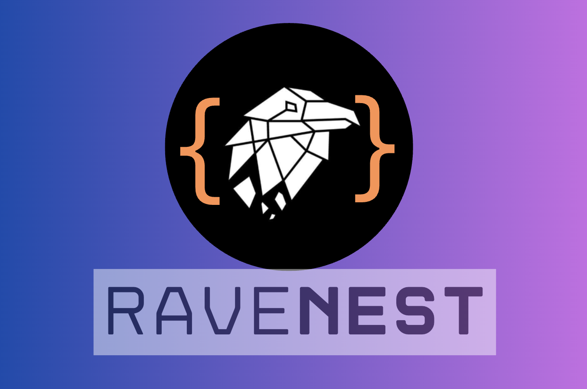

<p align="center">
  
</p>

# 🎸 RaveNest - Where Tech Mentorship Rocks! 🚀

RaveNest is where coding dreams come true! We're not just another mentorship platform - we're your backstage pass to tech success. Whether you're an aspiring rockstar developer or a seasoned tech legend, RaveNest is your green room to growth. 

*Warning: May cause sudden urges to code amazing things! 🎵*

## 🎬 Live Demo

Coming soon! Our app is getting ready for its world tour - stay tuned for the big launch! 


*Welcome to where the magic happens - our sleek and intuitive landing page!*

## ✨ Features

- 🤝 **Mentor Matching**: Find your perfect tech bandmate (aka mentor)
- 💬 **Community Forums**: Join the tech conversation (no actual instruments required)
- 📊 **Interactive Dashboard**: Your personal tech concert setlist
- 🔒 **Secure Authentication**: Keeping the groupies out (just kidding, we love our users!)
- 📱 **Responsive Design**: Looks great from any seat in the house
- 🎨 **Modern UI/UX**: Because we believe good code should also look like a platinum record
- 📅 **Session Management**: Book your backstage passes (mentoring sessions) with ease

## 🛠️ Technologies

### Frontend
- ⚛️ React 18 (Our lead guitarist) [](https://reactjs.org)
- 🎨 TailwindCSS (The awesome outfit)
- 🔄 React Router (The tour manager)
- 📡 Axios (The sound engineer)
- 🎭 TypeScript (The strict choreographer)

### Backend
- 🚂 Node.js & Express.js (The rhythm section) [](https://nodejs.org)
- 😠PostgreSQL (The vault keeping all our greatest hits) [](https://www.postgresql.org)
- 🔄 Sequelize ORM (The producer)
- 🔐 JWT Authentication (The security team)
- 📝 TypeScript (Still keeping us in line)

### APIs
- 🔄 GitHub Trending API (Our tech charts)
- 🎨 DiceBear API (Avatar generation)
- 🌐 RESTful API endpoints for:
  - 👥 User Authentication
  - 🤝 Mentor Matching
  - 💬 Forum Management
  - 📊 Session Tracking

## 🚀 Getting Started

### Prerequisites
- Node.js (v18 or higher)
- PostgreSQL (v15 or higher)
- npm

### Installation

1. Clone the repository
```bash
git clone https://github.com/Muhsina-de/Ravenest.git
cd ravenest
```

2. Install dependencies
```bash
npm install
```

3. Set up environment variables
```bash
# In server directory, create a .env file
DB_NAME=your_db_name
DB_USER=your_db_user
DB_PASSWORD=your_db_password
JWT_SECRET=your_jwt_secret
```

4. Start the development server
```bash
npm run dev
```
*This will start both the client and server concurrently. Rock on! 🎸*

## 🎯 Usage

1. **Register/Login**: Join the band
2. **Complete Profile**: Set up your tech rider
3. **Find Mentors**: Meet your tech heroes
4. **Schedule Sessions**: Book your jam sessions
5. **Engage**: Hit the stage (forums)

## 🎭 Meet the Band

### Guy Ricketts (Project Lead) [@KnifeDad](https://github.com/KnifeDad)
*The Frontman & Full-Stack Virtuoso*
- Frontend and Backend mastery
- System architecture & UI/UX design
- User Dashboard & Profile systems
- Review, Rating & Booking systems
- Forum system optimization
- Project Demo maestro

### Muhsina Shinwari (Project Manager) [@Muhsina-de](https://github.com/Muhsina-de)
*The Technical Producer & Authentication Specialist*
- Database architecture
- JWT authentication implementation
- GitHub API integration
- Forum system enhancement
- CSS styling mastery
- Project presentation

### Sebastian Bonilla (Software Developer)
*The Forum Maestro*
- Discussion Forum implementation
- Topics & Comments architecture
- Database seeding expertise

### Maurice Lowery (Research Analyst)
*The Design Guru*
- UX/UI research and implementation
- CSS styling wizardry
- API integration specialist

## 🏗️ Project Structure

```
ravenest/
├── client/                 # Frontend React application
│   ├── src/
│   │   ├── components/    # Reusable UI components
│   │   ├── contexts/      # React contexts
│   │   ├── pages/        # Page components
│   │   ├── services/     # API services
│   │   └── utils/        # Utility functions
│   └── ...
├── server/                # Backend Node.js application
│   ├── src/
│   │   ├── controllers/  # Route controllers
│   │   ├── models/       # Sequelize models
│   │   ├── routes/       # Express routes
│   │   ├── middleware/   # Custom middleware
│   │   └── utils/        # Utility functions
│   └── ...
└── ...
```

## 🤝 Contributing

Want to join the band? We welcome contributions! 

1. Fork the repository
2. Create your feature branch (`git checkout -b feature/AmazingFeature`)
3. Commit your changes (`git commit -m 'Add some AmazingFeature'`)
4. Push to the branch (`git push origin feature/AmazingFeature`)
5. Open a Pull Request

## 📜 License

This project is licensed under the MIT License - see the [LICENSE](LICENSE) file for details.
[](https://opensource.org/licenses/MIT)

## 🙏 Acknowledgments

Special thanks to:
- Our amazing families and friends for their endless support and coffee runs
- Our incredible bootcamp instructor, Matthew Miller, for being the best teacher anyone could ask for
- The tech community for keeping the inspiration flowing
- Coffee ☕ - because no great code was ever written without it!

---

<p align="center">Made with 🎸 by the RaveNest Team</p> 